On July 18, 2025, Amazon ECS received a major deployment enhancement. It's not just about native Blue/Green support - there's much more to it!

## Key Points

- Native Blue/Green is now available without CodeDeploy
  - Various validation timings through lifecycle hooks with Lambda
  - Pre-validation in production environment with zero user impact (Dark Canary) using test listeners/listener rules
- Blue/Green is now supported with Service Connect
- Deployment controller can be changed after service creation
- You should avoid CodeDeploy-based Blue/Green (migration guide available)

**Note**: This article does not cover Blue/Green with Service Connect.

## Update Overview

https://aws.amazon.com/about-aws/whats-new/2025/07/amazon-ecs-built-in-blue-green-deployments/

Blue/Green deployment is now available as a built-in ECS feature without requiring CodeDeploy.
You can select it directly from the console:

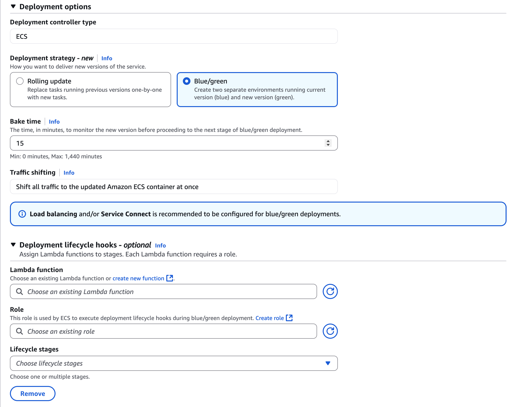

This B/G deployment comes with two optional features that make automated and safe deployments easier:
- Deployment lifecycle hooks for custom validation
- Test listener / listener rules for Dark Canary

Also, there's a subtle but significant update: "deployment controller can be changed after service creation."

### Previous Situation

When implementing Blue/Green in ECS, combining with CodeDeploy was common but had several pain points:
- Required cumbersome CodeDeploy setup
- Couldn't switch between rolling update ↔ B/G after service creation
- Had various constraints when combined with CodeDeploy
  - Example: Couldn't use Service Connect

Rolling updates also had challenges:
- Limited flexibility in success/failure determination (despite having CloudWatch alarms and deployment circuit breakers)
- Time-consuming rollbacks (requiring new task launches)

### Benefits of This Update

- Easy Blue/Green deployment without CodeDeploy setup
- Can switch between rolling update ↔ B/G **even after service creation**
  - Basically just change the `strategy`. No service recreation & migration needed
  - Easy to "start simple with rolling update, switch to B/G when needed"
  - Detailed migration guide in [this documentation](https://docs.aws.amazon.com/AmazonECS/latest/developerguide/migrate-deployment-strategies.html)
    - Also includes B/G → rolling update migration, suggesting rolling updates aren't deprecated
- Features from CodeDeploy are available, making it convenient + easy to migrate from CodeDeploy
  - Flexible validation with Lambda
  - Zero-impact new version testing in production environment
- Being a native feature, likely to have fewer constraints than CodeDeploy integration
- **Blue/Green deployment now works with Service Connect**
  - Removes one drawback of Service Connect and shows it's being actively maintained

## Detailed Features

### Deployment Lifecycle Hooks

https://docs.aws.amazon.com/AmazonECS/latest/developerguide/deployment-lifecycle-hooks.html

In native Blue/Green, you can validate deployment success using custom logic through Lambda functions at various stages.
For example, you can monitor service status, access endpoints, or check telemetry data.

This is similar to [CodeDeploy's hooks feature](https://docs.aws.amazon.com/codedeploy/latest/userguide/reference-appspec-file-structure-hooks.html#appspec-hooks-ecs).

#### Lifecycle Stages

There are 7 hook timings (lifecycle stages):
1. `PRE_SCALE_UP`: Before new tasks launch
2. `POST_SCALE_UP`: After new tasks launch and become healthy
3. `TEST_TRAFFIC_SHIFT`: During test traffic shift to Green (0->100%)
4. `POST_TEST_TRAFFIC_SHIFT`: After test traffic is 100% on Green
5. `PRODUCTION_TRAFFIC_SHIFT`: During production traffic shift to Green
6. `POST_PRODUCTION_TRAFFIC_SHIFT`: After production traffic shift to Green
7. `RECONCILE_SERVICE`: When deployment starts with multiple ACTIVE service revisions
   - Not selectable in console but available via CLI. Purpose unclear.

During rollback, `TEST_TRAFFIC_SHIFT` and `PRODUCTION_TRAFFIC_SHIFT` are hooked.

#### Event Payload

The event payload includes service ARN and weight information, allowing validation logic based on these values.

Example:
```json
Event: 
{
    "executionDetails": {
        "testTrafficWeights": {},
        "productionTrafficWeights": {
            "arn:aws:ecs:ap-northeast-1:<account-id>:service-revision/my-cluster/native-bg-1/9942985458929989075": 0,
            "arn:aws:ecs:ap-northeast-1:<account-id>:service-revision/my-cluster/native-bg-1/2948000638822554633": 100
        },
        "serviceArn": "arn:aws:ecs:ap-northeast-1:<account-id>:service/my-cluster/native-bg-1",
        "targetServiceRevisionArn": "arn:aws:ecs:ap-northeast-1:<account-id>:service-revision/my-cluster/native-bg-1/2948000638822554633"
    },
    "executionId": "06a4bc13-a7fa-4281-ab04-3aa34234ddxx",
    "lifecycleStage": "PRODUCTION_TRAFFIC_SHIFT",
    "resourceArn": "arn:aws:ecs:ap-northeast-1:<account-id>:service-deployment/my-cluster/native-bg-1/PNpQryOI09kD3iMrxsoxx"
}
```

#### Function Return Values

- `hookStatus=SUCCEEDED`: Validation successful, deployment proceeds
- `hookStatus=FAILED`: Triggers rollback
- `hookStatus=IN_PROGRESS`: Function called again after a delay
  - Useful for long-running checks or when validation data isn't yet available
  - [Official blog](https://aws.amazon.com/blogs/aws/accelerate-safe-software-releases-with-new-built-in-blue-green-deployments-in-amazon-ecs/) mentions 30-second intervals, confirmed in testing
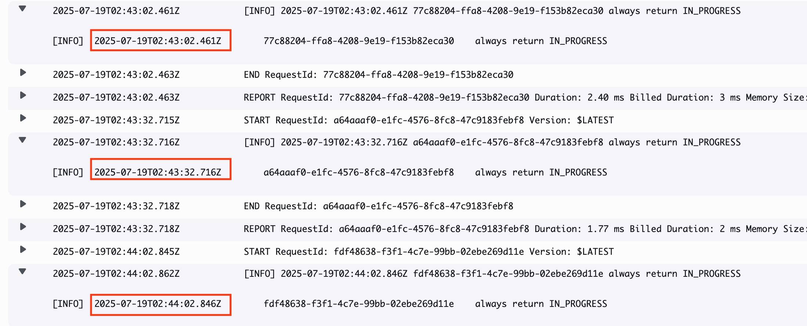

#### Note: Partially Available in Rolling Update??

While the console doesn't show lifecycle hooks or bake time settings for rolling updates,
CLI allows selecting these with rolling updates. LB settings from B/G remain.

In actual deployment, only the `PRE_SCALE_UP` hook triggered Lambda. Unclear if this is intended behavior.

### Test Listener / Listener Rule (Dark Canary)

Using test listeners/listener rules, developers/testers can access the Green environment before production traffic shifts.
Called "Dark Canary" as end users don't access it.

#### Benefits

Compared to simple Blue/Green, reduces risks of:
- "Complete disaster when 100% traffic shifted to Green, even temporarily"
- "Works in staging but fails in production..."

#### Usage

Create separate access routes for developers using:
- Listeners with different ports
- Listener rules with conditions (headers, source IPs, etc.)

This phase is validated by `TEST_TRAFFIC_SHIFT` and `POST_TEST_TRAFFIC_SHIFT` hooks.
- Return `hookStatus=IN_PROGRESS` for zero-impact rollback
- Deployment stays `IN_PROGRESS` while returning `hookStatus=IN_PROGRESS` (timeout unknown, confirmed >3 hours)
  - For manual validation, consider having Lambda monitor a flag and return `hookStatus=SUCCEEDED` when set

### Additionally, Deployment Controller Now Updatable Post-Creation

https://docs.aws.amazon.com/AmazonECS/latest/developerguide/update-service-parameters.html

A subtle but important documentation update.

Background: There are 3 [deployment controllers](https://docs.aws.amazon.com/AmazonECS/latest/APIReference/API_DeploymentController.html):

- `ECS` (Enhanced now, most common)
- `CODE_DEPLOY` (Traditional B/G deployment)
- `EXTERNAL` (For customization. Details: [ECS External Deployment & TaskSet Guide](https://zenn.dev/cadp/articles/ecs-external))

Previously unchangeable after service creation, now supports 4 update patterns:

- `CODE_DEPLOY` -> `ECS`
- `CODE_DEPLOY` -> `EXTERNAL`
- `ECS` -> `EXTERNAL`
- `EXTERNAL` -> `ECS`

*Hmm?*

#### Signs of `CODE_DEPLOY` Type Deprecation *Not CodeDeploy itself*

Notice no update patterns TO `CODE_DEPLOY`.

The `CODE_DEPLOY` docs [clearly recommend](https://docs.aws.amazon.com/AmazonECS/latest/developerguide/deployment-type-bluegreen.html) the new native B/G:
> We recommend that you use the Amazon ECS blue/green deployment.

`CODE_DEPLOY` option removed from console.
Migration docs provided:
- [To native B/G](https://docs.aws.amazon.com/AmazonECS/latest/developerguide/migrate-codedeploy-to-ecs-bluegreen.html)
- [To rolling update](https://docs.aws.amazon.com/AmazonECS/latest/developerguide/migrate-code-deploy-to-ecs-rolling.html)

This likely prompted deployment controller update support.

No deprecation notices or migration guides for `EXTERNAL`, suggesting it's safe.

*Like EKS on Fargate Auto Mode, nice to see deprecation/removal after superior alternatives emerge. Unlike certain other cases...*

#### Benefits of This Update

Makes `CODE_DEPLOY` to `ECS` migration easier.

Also greatly simplifies [PipeCD](https://pipecd.dev/) migration for ECS.

PipeCD uses `EXTERNAL` for ECS deployments.
Previously, migrating from rolling update(`ECS`) or `CODE_DEPLOY` required service recreation.
For running services, complex ALB listener-based migration was needed.

Now possible without service recreation (both to and from PipeCD).

Also enables:
- "Switch from `ECS` to `EXTERNAL` for customization"
- "Try `EXTERNAL`, revert to `ECS` if too complex"

#### Note

Can't migrate from `ECS` if using VPC Lattice or Service Connect:

> You can't update the deployment controller of a service from the ECS deployment controller to any of the other controllers if it uses VPC Lattice or Amazon ECS Service Connect.

## How It Works (ALB Case)

https://docs.aws.amazon.com/AmazonECS/latest/developerguide/bluegreen-how-it-works.html

### Deployment Flow

Created diagram as [official one](https://docs.aws.amazon.com/images/AmazonECS/latest/developerguide/images/bluegreen.png) felt incomplete:

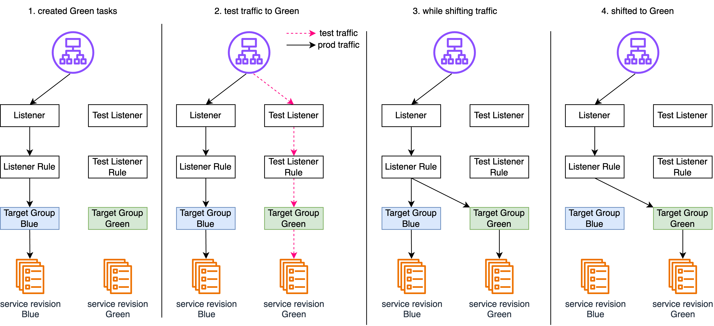

1. Initial State ~ Green Environment Launch
   1. Initial state: Blue environment receiving 100% traffic
   2. Launch Green tasks, attach to Green target group
   3. ALB health checks Green environment
2. Internal Green environment testing (no production traffic)
3. Switch production traffic to Green
   - Brief for "All at once"
4. Post-Green Switch ~ Deployment Complete
   1. Monitor: Watch CloudWatch alarms, auto-rollback if issues
      - Continues until **Bake Time** parameter expires
   2. Delete Blue tasks
   3. Deployment complete

Next deployment reverses Blue/Green, moving from Target Group Green to Blue.

### During Rollback

Rollback simply returns traffic to coexisting Blue environment via listener rules.
Faster than rolling update as no task launches needed.

## Hands-On Testing

Following this official blog:

https://aws.amazon.com/blogs/aws/accelerate-safe-software-releases-with-new-built-in-blue-green-deployments-in-amazon-ecs/

Resource details here:

https://docs.aws.amazon.com/AmazonECS/latest/developerguide/alb-resources-for-blue-green.html

### 1. Service Update

Configuration:

- task definition: httpd → nginx
- Deployment options
  - Deployment controller type: `ECS`
    - Previously chose between `ECS` or `CODE_DEPLOY`
  - **strategy**: Blue/Green
  - **Bake time**: 5 minutes
  - **lifecycle hooks**:
    - Lambda function: Simple function returning `"hookStatus": "SUCCEEDED"` after accessing ALB URL
      ```python
      import json
      import urllib3
      import logging
      import base64
      import os

      # Configure logging
      logger = logging.getLogger()
      logger.setLevel(logging.DEBUG)

      # Initialize HTTP client
      http = urllib3.PoolManager()

      def lambda_handler(event, context):
          """
         Validation hook that tests the green environment by accessing "/"
          """
         logger.info(f"Event: {json.dumps(event)}")
         logger.info(f"Context: {context}")
          
          try:
         test_endpoint = os.getenv("APP_URL")
              
         response = http.request(
                  'GET', 
         test_endpoint,
                  timeout=30
              )
              
         logger.info(f"GET / response status: {response.status}")
              
              # Check if response has OK status code (200-299 range)
              if 200 <= response.status < 300:
         logger.info("test passed - received OK status code")
                  return {
                      "hookStatus": "SUCCEEDED"
                  }
              else:
         logger.error(f"test failed - status code: {response.status}")
                  return {
                      "hookStatus": "FAILED"
                  }
                  
          except Exception as error:
         logger.error(f"test failed: {str(error)}")
              return {
                  "hookStatus": "FAILED"
              }
      ```

    - Role: Role with `lambda:InvokeFunction`. [Reference](https://docs.aws.amazon.com/AmazonECS/latest/developerguide/blue-green-permissions.html)
      - Role for ECS to invoke Lambda
    - **Lifecycle stages**: All 6 selected

- Load balancing
  - Role: Policy based on [this doc](https://docs.aws.amazon.com/AmazonECS/latest/developerguide/AmazonECSInfrastructureRolePolicyForLoadBalancers.html)
    - Role for ECS to update listener rules
    - Added `elasticloadbalancing` permissions (`DescribeTargetGroups`, `DescribeTargetHealth`,`RegisterTargets`,`DeregisterTargets`) due to permission errors
  - Load balancer type: ALB
  - Listener (production): HTTP:80
  - Production listener rule: Listener default
  - **Test listener** (Green test access): Different port HTTP:81
  - **Test listener rule**: Listener default
  - Target group (Blue): IP type with HTTP:80
  - **Alternate target group** (Green): Same settings as Blue
    - "Create alternate target group" option creates with just naming

### 2. Deployment

#### 2-1. Test Traffic

First, Green tasks launched and `POST_SCALE_UP` lifecycle hooks succeeded.
Green accessible via test listener (HTTP:81).

Green port 81 showed nginx:
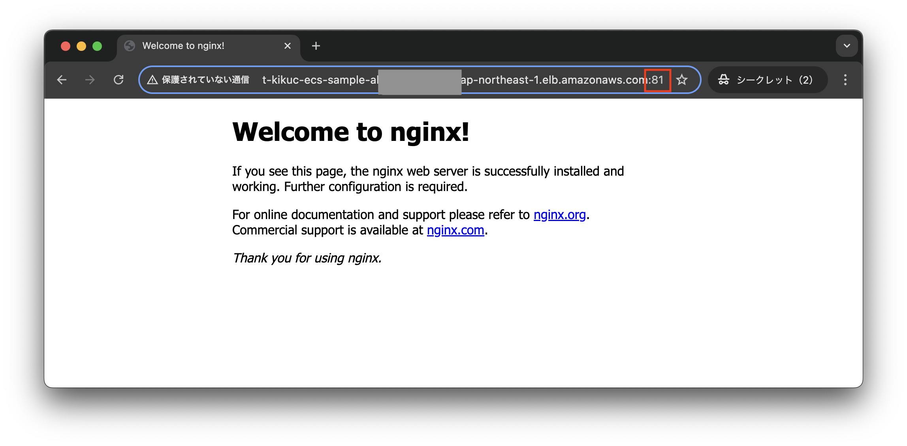
Blue port 80 showed httpd:
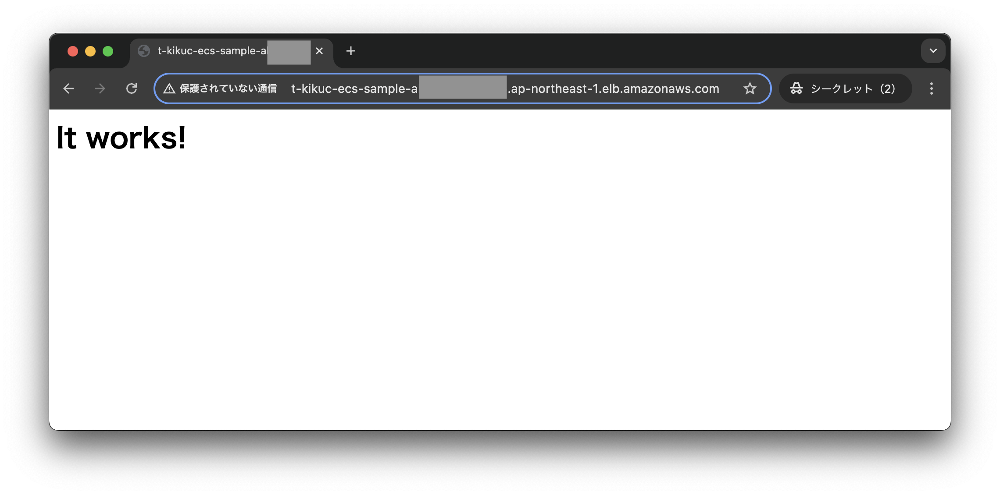

ALB test listener (port 81) rule changed to Green (group2):

Production listener (port 80) rule still Blue:
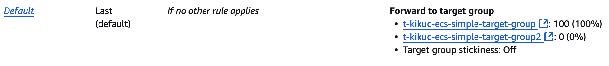

`POST_TEST_TRAFFIC_SHIFT` lifecycle hooks succeeded.

#### 2-2. Production Traffic Switch

Production traffic switches to Green.

Port 80 access switched to nginx:
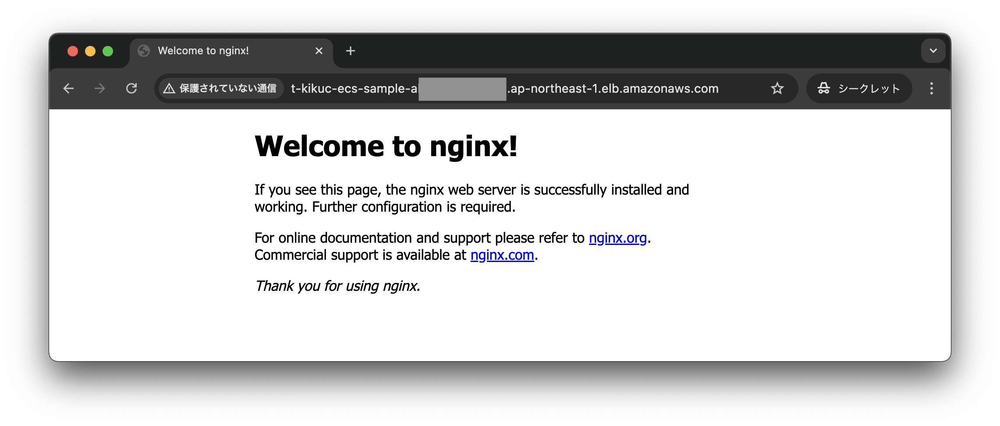

ALB production listener rule switched to Green:
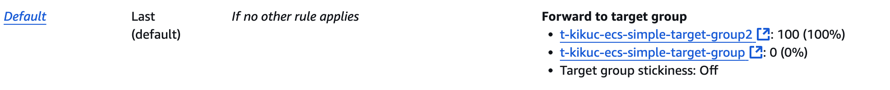

Test listener still accessed Green environment.

#### 2-3. Bake Time

Blue(Source) tasks still running for fast rollback, no production traffic:
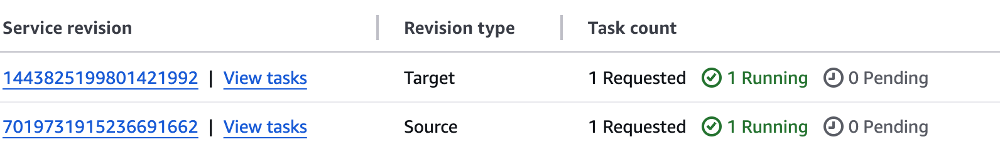

After bake time, Blue tasks deleted:
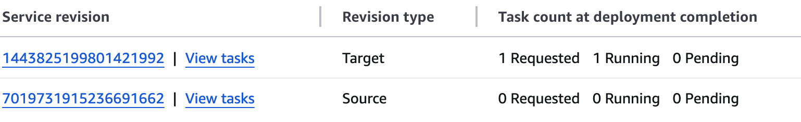

Event history shows:
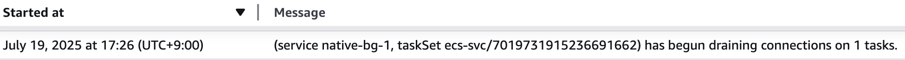

#### Deployment Status Monitoring

Current stage visible in Deployments screen:
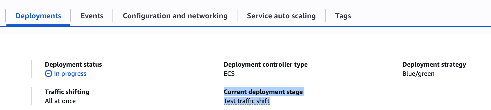

Click stage to see hook-Lambda function mappings:
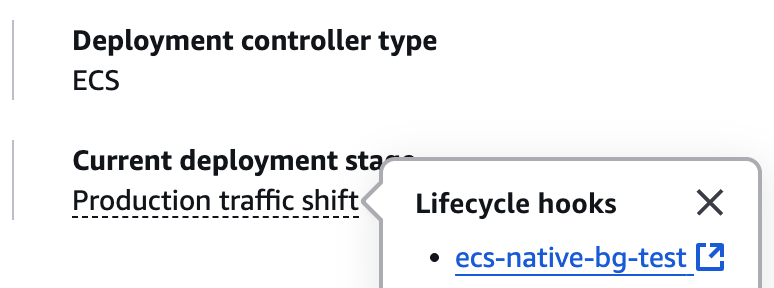

Personally, stage start/end status in Events would help track timing and troubleshoot.

### 3. Testing Hook Failure

Testing rollback by failing `POST_SCALE_UP` lifecycle hooks.

**1. Replace Lambda function**

Use this always failing function:

```python
import logging
import json

logger = logging.getLogger()
logger.setLevel(logging.DEBUG)

def lambda_handler(event, context):
 logger.info(f"always return failure")
    return {
        "hookStatus": "FAILED"
    }
```

**2. Change Lifecycle hooks to `POST_SCALE_UP` only**

Avoid "Rollback failed" from hook failures during rollback's `PRODUCTION_TRAFFIC_SHIFT`.

**3. Update service to trigger deployment**

Changed task definition revision.

`POST_SCALE_UP` failed, triggering rollback:

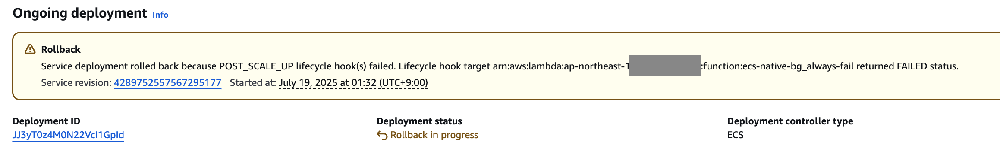

## Notes

- No Canary support
  - CodeDeploy had Canary option, hopefully added later
  - `Traffic shifting` section looks ready for options...
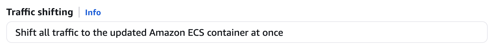

- Auto Scaling warning:

  > If your service uses auto scaling, be aware that auto scaling is not blocked during a blue/green deployment, but the deployment might fail under certain circumstances.

https://docs.aws.amazon.com/AmazonECS/latest/developerguide/deployment-type-bluegreen.html

## Note: "Rolling Update" Deployment Type Naming Issue

What should we call deployment type `ECS` now?
Previously "ECS (rolling update)", but now includes B/G.

Documentation still refers to "using rolling update" likely meaning deployment type=`ECS`. Awaiting updates. Example:

> Only services that use rolling deployments are supported with Service Connect.

https://docs.aws.amazon.com/AmazonECS/latest/developerguide/service-connect-concepts-deploy.html#service-connect-considerations

## Conclusion

This is one of ECS's biggest updates recently, including deployment controller updates.
I'm curious about Service Connect's Blue/Green.

I'm relieved about continued Service Connect and External deployment support. However, `CODE_DEPLOY` type should probably be avoided going forward.
